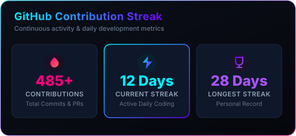

<!--
  Modern dark glass GitHub profile README for biswajitgitlab.
  The attached "README (1).md" was treated as visual inspiration and asset reference only.

  Web visuals used:
  - https://github.com/kyechan99/capsule-render
  - https://github.com/DenverCoder1/readme-typing-svg
  - https://github.com/Anmol-Baranwal/Cool-GIFs-For-GitHub
  - https://skillicons.dev
  - local dark glass SVG stat cards in ./images
-->

  

  
  
  
  

    

  

  

<table width="100%">
  <tr>
    <td width="58%" valign="top">
      <h2>Glass Console</h2>
      

        I build AI automation systems that feel sharp on the surface and reliable underneath:
        agents, workflow engines, document intelligence, APIs, dashboards, and production-ready
        full stack applications.
      

      

        My current focus is turning manual business processes into clean, observable automation
        using <b>Python</b>, <b>n8n</b>, <b>Ollama</b>, <b>RAG</b>, <b>Laravel</b>, and cloud-ready
        deployment patterns.
      

      

        
        
        
        
      

    </td>
    <td width="42%" align="center" valign="middle">
      
    </td>
  </tr>
</table>

 

  

 

  

 

<table width="100%">
  <tr>
    <td width="33%" valign="top">
      <h3>AI Automation</h3>
      
Agent workflows, n8n pipelines, local LLM tooling, RAG retrieval, prompt routing, and structured extraction.

      

        
        
      

    </td>
    <td width="33%" valign="top">
      <h3>Product Engineering</h3>
      
Laravel applications, API-first backends, MySQL/Postgres data models, queue work, admin panels, and clean UI flows.

      

        
        
      

    </td>
    <td width="33%" valign="top">
      <h3>Delivery</h3>
      
Dockerized services, AWS deployment paths, GitHub Actions, Linux servers, test automation, and production debugging.

      

        
        
      

    </td>
  </tr>
</table>

 

  

 

<table width="100%">
  <tr>
    <td width="50%" valign="top">
      
      
<b>AI Automated Workflow System</b>

      
Data extraction and processing pipeline for moving messy inputs into useful, repeatable outputs.

      

        
        
        
      

    </td>
    <td width="50%" valign="top">
      
      
<b>RAG Document AI Chatbot</b>

      
Private document querying with local models, retrieval, vector search, and answer grounding.

      

        
        
        
      

    </td>
  </tr>
  <tr>
    <td width="50%" valign="top">
      
      
<b>Full Stack Laravel Application</b>

      
Production-focused web app patterns with auth, dashboards, database design, testing, and CI.

      

        
        
        
      

    </td>
    <td width="50%" valign="top">
      
      
<b>Containerized AI Agent Orchestration</b>

      
Composable services for automated operations, worker queues, deployment, and monitoring.

      

        
        
        
      

    </td>
  </tr>
</table>

 

  

 

  

 

<table width="100%">
  <tr>
    <td width="50%" align="center">
      
    </td>
    <td width="50%" align="center">
      
    </td>
  </tr>
</table>

  

 

  

 

<table width="100%">
  <tr>
    <td width="25%" align="center"><b>Workflow audits</b> Find manual work worth automating</td>
    <td width="25%" align="center"><b>AI prototypes</b> Move from idea to usable agent</td>
    <td width="25%" align="center"><b>Laravel builds</b> Ship admin tools and APIs</td>
    <td width="25%" align="center"><b>Cloud delivery</b> Package, deploy, and monitor</td>
  </tr>
</table>

 

  
  
  

  

