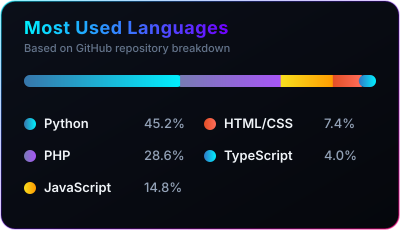
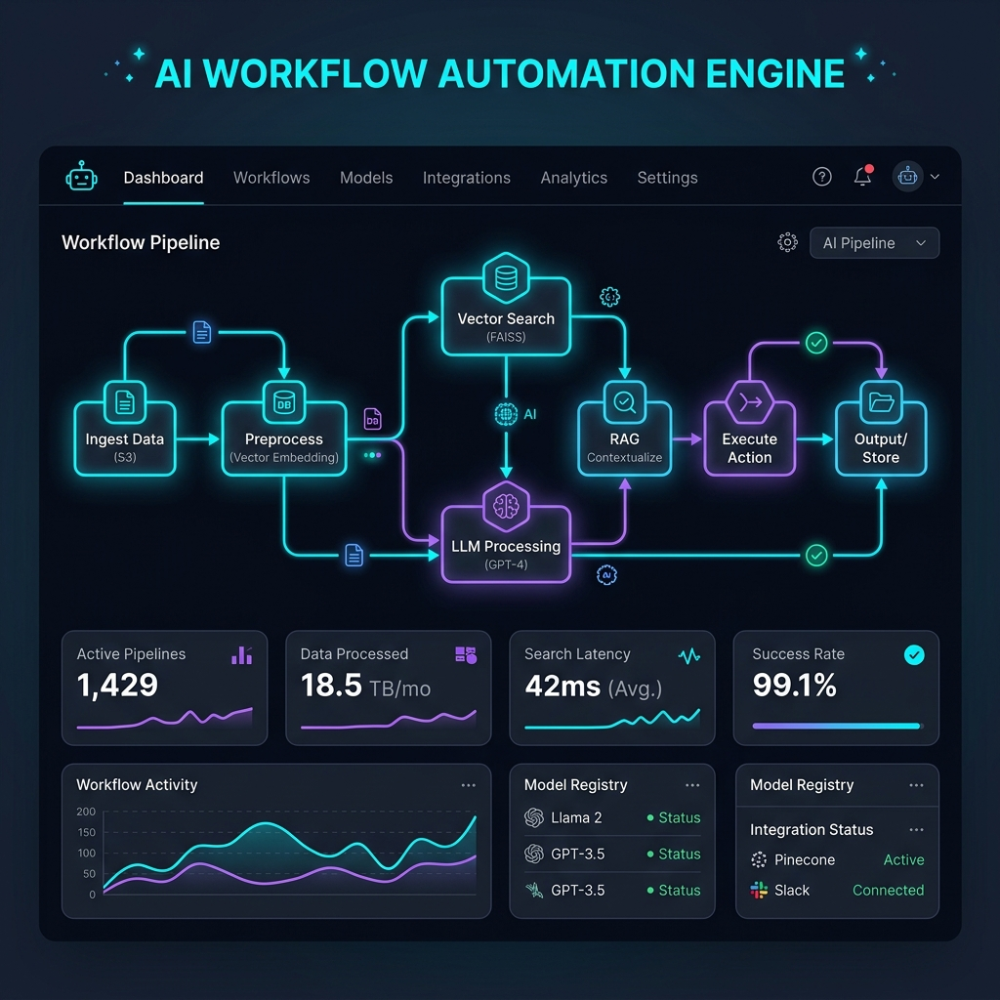
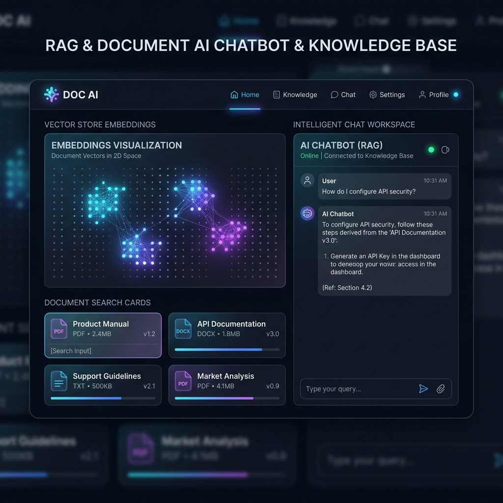
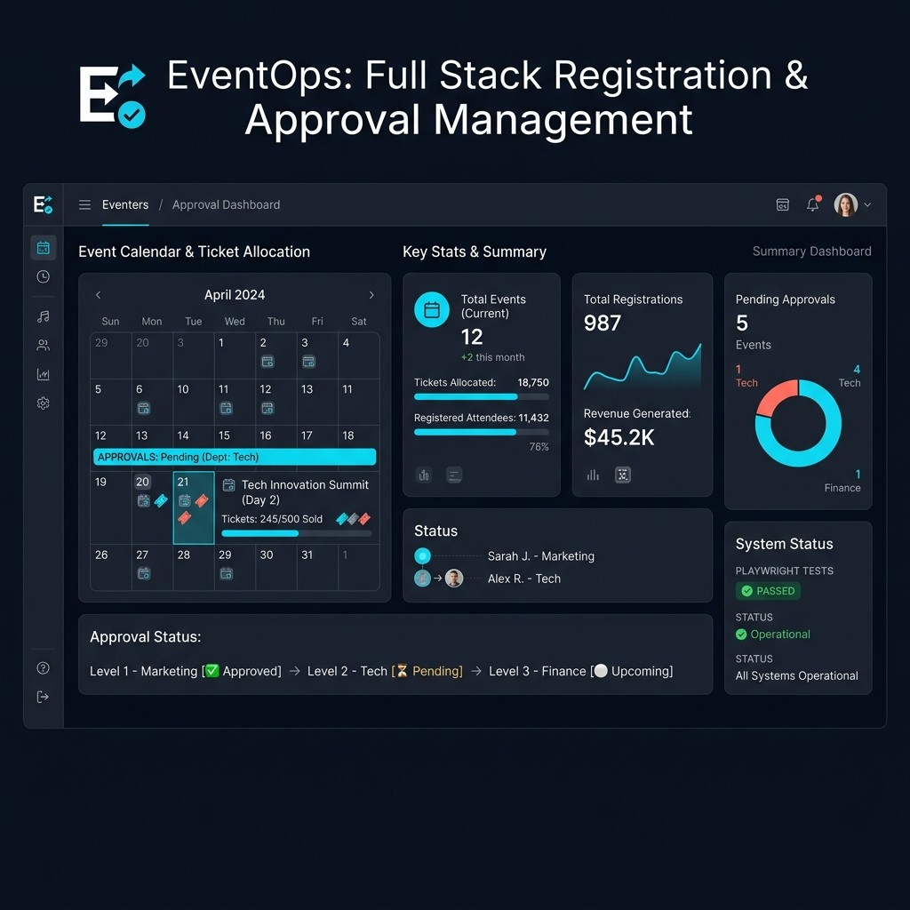
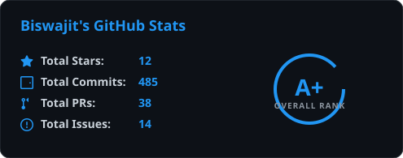

<!-- 
  ╔══════════════════════════════════════════════════════════════════════════╗
  ║  ULTRA-MODERN CYBER-DARK GITHUB PROFILE README                           ║
  ║  Biswajit Sarkar — AI Automation Engineer & Full Stack Developer         ║
  ║  Theme: Pitch Black (#000000) | Electric Cyan (#00F0FF) | Violet (#7000FF)║
  ╚══════════════════════════════════════════════════════════════════════════╝
-->

  <!-- Waving Header Banner -->
  
  
   

  <!-- Glowing Cyan & Violet Frame Header Container -->
  <table width="92%" bgcolor="#00F0FF" cellpadding="1.5" cellspacing="0" border="0" style="border-radius: 12px; overflow: hidden;">
    <tr>
      <td>
        <table width="100%" bgcolor="#05070C" cellpadding="24" cellspacing="0" border="0" style="border-radius: 11px;">
          <tr>
            <td align="center">
              <!-- Typing Animation SVG -->
              
                
              <!-- Live Status Badges Bar -->
              <table bgcolor="#0B0F19" cellpadding="8" cellspacing="0" border="0" style="border-radius: 8px; border: 1px solid #1E293B;">
                <tr>
                  <td>
                    
                  </td>
                  <td>
                    
                  </td>
                  <td>
                    
                  </td>
                </tr>
              </table>
            </td>
          </tr>
        </table>
      </td>
    </tr>
  </table>

  

<!-- ═══════════════════════════════════════════════════════════════════════════ -->
<!-- ABOUT ME — Executive Overview + Modern SVG Language Card                    -->
<!-- ═══════════════════════════════════════════════════════════════════════════ -->

<h3 align="center">
  
</h3>

<table width="100%" cellpadding="0" cellspacing="0" border="0">
  <tr>
    <!-- Left Column: About Info -->
    <td width="58%" valign="top">
      <table width="100%" bgcolor="#0B0F19" cellpadding="20" cellspacing="0" border="0" style="border: 1px solid #1E293B; border-radius: 12px;">
        <tr>
          <td>
            

              👋 Welcome! I am an <b>AI Automation Engineer &amp; Full Stack Developer</b> specializing in creating autonomous workflows, self-hosted LLM agents, and scalable enterprise applications.
            

            

            
🎯 <b>Primary Focus:</b> AI Agent orchestration with <b>n8n</b>, local LLMs utilizing <b>Ollama</b>, and Retrieval-Augmented Generation (<b>RAG</b>) vector pipelines.

            
💻 <b>Full Stack Expertise:</b> Building backend services using <b>Python (FastAPI/Flask)</b> &amp; <b>PHP (Laravel)</b> with reactive modern frontends.

            
⚙️ <b>DevOps &amp; Testing:</b> Containerized microservices using <b>Docker</b>, CI/CD pipelines, and robust automated E2E testing with <b>Playwright</b>.

            
⚡ <b>Engineering Philosophy:</b> Automate repetitive tasks, simplify complex systems, and deliver high-impact software.

          </td>
        </tr>
      </table>
    </td>
    <td width="4%"></td>
    <!-- Right Column: Languages Visual SVG Card -->
    <td width="38%" valign="top" align="center">
      
    </td>
  </tr>
</table>

  

<!-- ═══════════════════════════════════════════════════════════════════════════ -->
<!-- TECH STACK — 3-Column Glassmorphic Cards                                   -->
<!-- ═══════════════════════════════════════════════════════════════════════════ -->

<h3 align="center">
  
</h3>

<table width="100%" cellpadding="0" cellspacing="0" border="0">
  <tr>
    <!-- Column 1: AI & Automation -->
    <td width="32%" valign="top" align="center">
      <table width="100%" bgcolor="#0B0F19" cellpadding="16" cellspacing="0" border="0" style="border: 1px solid #1E293B; border-radius: 12px;">
        <tr>
          <td align="center">
            <h4 style="color: #00F0FF; margin-top: 0;">🤖 AI &amp; Automation</h4>
            
              
            
            
            
            
            
          </td>
        </tr>
      </table>
    </td>
    <td width="2%"></td>
    <!-- Column 2: Languages & Frameworks -->
    <td width="32%" valign="top" align="center">
      <table width="100%" bgcolor="#0B0F19" cellpadding="16" cellspacing="0" border="0" style="border: 1px solid #1E293B; border-radius: 12px;">
        <tr>
          <td align="center">
            <h4 style="color: #7000FF; margin-top: 0;">💻 Languages &amp; Frameworks</h4>
            
              
            
            
            
          </td>
        </tr>
      </table>
    </td>
    <td width="2%"></td>
    <!-- Column 3: Cloud, DBs & Testing -->
    <td width="32%" valign="top" align="center">
      <table width="100%" bgcolor="#0B0F19" cellpadding="16" cellspacing="0" border="0" style="border: 1px solid #1E293B; border-radius: 12px;">
        <tr>
          <td align="center">
            <h4 style="color: #FF007A; margin-top: 0;">☁️ DevOps &amp; Databases</h4>
            
              
            
            
            
          </td>
        </tr>
      </table>
    </td>
  </tr>
</table>

  

<!-- ═══════════════════════════════════════════════════════════════════════════ -->
<!-- FEATURED PROJECTS — Visual Showcase Grid                                    -->
<!-- ═══════════════════════════════════════════════════════════════════════════ -->

<h3 align="center">
  
</h3>

<table width="100%" cellpadding="0" cellspacing="0" border="0">
  <!-- Row 1 -->
  <tr>
    <!-- Project 1: AI Workflow Automation Engine -->
    <td width="48%" valign="top">
      <table width="100%" bgcolor="#0B0F19" cellpadding="0" cellspacing="0" border="0" style="border: 1px solid #1E293B; border-radius: 12px; overflow: hidden;">
        <tr>
          <td>
            
          </td>
        </tr>
        <tr>
          <td cellpadding="16">
            <h4 style="color: #00F0FF; margin-top: 5px; margin-bottom: 8px;">🤖 AI Workflow Automation Engine</h4>
            

              Autonomous multi-step data processing &amp; intelligence pipeline combining n8n, Python microservices, and Ollama local LLMs.
            

            

              
              
              
              
            

            

              
              &nbsp;
              
            

          </td>
        </tr>
      </table>
    </td>
    <td width="4%"></td>
    <!-- Project 2: Enterprise RAG Chatbot -->
    <td width="48%" valign="top">
      <table width="100%" bgcolor="#0B0F19" cellpadding="0" cellspacing="0" border="0" style="border: 1px solid #1E293B; border-radius: 12px; overflow: hidden;">
        <tr>
          <td>
            
          </td>
        </tr>
        <tr>
          <td cellpadding="16">
            <h4 style="color: #7000FF; margin-top: 5px; margin-bottom: 8px;">📄 Enterprise RAG Knowledge Base</h4>
            

              Privacy-first document querying engine using local vector search (ChromaDB), LangChain embeddings, and local context retrieval.
            

            

              
              
              
              
            

            

              
              &nbsp;
              
            

          </td>
        </tr>
      </table>
    </td>
  </tr>

  <tr><td colspan="3"> </td></tr>

  <!-- Row 2 -->
  <tr>
    <!-- Project 3: Full Stack Approval System -->
    <td width="48%" valign="top">
      <table width="100%" bgcolor="#0B0F19" cellpadding="0" cellspacing="0" border="0" style="border: 1px solid #1E293B; border-radius: 12px; overflow: hidden;">
        <tr>
          <td>
            
          </td>
        </tr>
        <tr>
          <td cellpadding="16">
            <h4 style="color: #FF007A; margin-top: 5px; margin-bottom: 8px;">🌐 Full Stack Event &amp; Approval System</h4>
            

              Enterprise event platform featuring dynamic custom forms, quota management, multi-tier approvals, and Playwright E2E automation.
            

            

              
              
              
              
            

            

              
              &nbsp;
              
            

          </td>
        </tr>
      </table>
    </td>
    <td width="4%"></td>
    <!-- Project 4: Microservice Agent Orchestration -->
    <td width="48%" valign="top">
      <table width="100%" bgcolor="#0B0F19" cellpadding="0" cellspacing="0" border="0" style="border: 1px solid #1E293B; border-radius: 12px; overflow: hidden;">
        <tr>
          <td>
            
          </td>
        </tr>
        <tr>
          <td cellpadding="16">
            <h4 style="color: #00F0FF; margin-top: 5px; margin-bottom: 8px;">🐳 Containerized Agent Microservices</h4>
            

              Production multi-agent cloud infrastructure built with Docker, Redis queues, and AWS container deployment pipelines.
            

            

              
              
              
              
            

            

              
              &nbsp;
              
            

          </td>
        </tr>
      </table>
    </td>
  </tr>
</table>

  

<!-- ═══════════════════════════════════════════════════════════════════════════ -->
<!-- GITHUB METRICS & ANALYTICS                                                 -->
<!-- ═══════════════════════════════════════════════════════════════════════════ -->

<h3 align="center">
  
</h3>

  <table width="100%" cellpadding="0" cellspacing="0" border="0">
    <tr>
      <!-- Custom GitHub Overview SVG -->
      <td width="48%" align="center" valign="top">
        
      </td>
      <td width="4%"></td>
      <!-- Contribution Streak Stats -->
      <td width="48%" align="center" valign="top">
        
      </td>
    </tr>
  </table>

  

<!-- ═══════════════════════════════════════════════════════════════════════════ -->
<!-- CONTRIBUTION SNAKE ANIMATION                                                -->
<!-- ═══════════════════════════════════════════════════════════════════════════ -->

<h3 align="center">
  
</h3>

  <picture>
    <source media="(prefers-color-scheme: dark)" srcset="https://raw.githubusercontent.com/Platane/snk/output/github-contribution-grid-snake-dark.svg" />
    <source media="(prefers-color-scheme: light)" srcset="https://raw.githubusercontent.com/Platane/snk/output/github-contribution-grid-snake.svg" />
    
  </picture>

  

<!-- ═══════════════════════════════════════════════════════════════════════════ -->
<!-- CONNECT & SOCIALS                                                           -->
<!-- ═══════════════════════════════════════════════════════════════════════════ -->

<h3 align="center">
  
</h3>

  <table cellpadding="6" cellspacing="0" border="0">
    <tr>
      <td>
        
      </td>
      <td>
        
      </td>
      <td>
        
      </td>
      <td>
        
      </td>
      <td>
        
      </td>
    </tr>
  </table>

  

<!-- ═══════════════════════════════════════════════════════════════════════════ -->
<!-- FOOTER — Views Counter & Waving Closing Banner                              -->
<!-- ═══════════════════════════════════════════════════════════════════════════ -->

  
    
  

